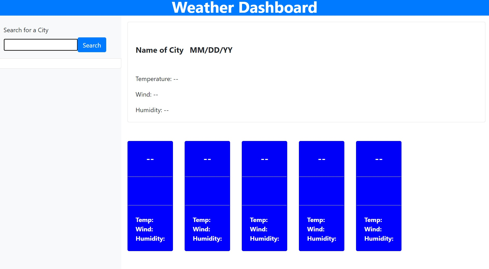
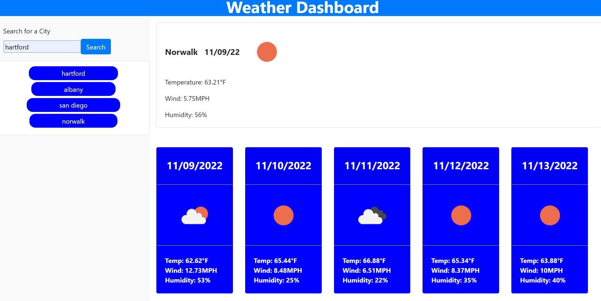

# Weather-Dashboard

## Description

While learning web development it is important to understand and utalize javascript and external API's.
This project allowed me to display my skills in javascript through the creation of a Weather Dashboard where
a user can search a city for a five day forecast.

## Table of Contents

- [Installation](#installation)
- [Usage](#usage)
- [Credits](#credits)
- [License](#license)

## Installation

To run this project, the user needs to open the index.html file in their web browser. It can also be
accessed by utalizing github live pages from this link. https://rjo6615.github.io/Weather-Dashboard/

## Usage

To use this project, start by typing the name of a city you with to know the weather for in the search field.
The site will then populate with the current day weather along with a five day forecast. A history of searches will
also appear under the search bar. Thes are clickable buttons that will re-search that city's weather. Your last search will always appear on top unless it has already been put into the history. Once there are 10 items in the search history, the last item will automatically be removed.

Example images are listed below:

## Credits

John Ifert-Miller
https://github.com/johnboy514

## License

N/A